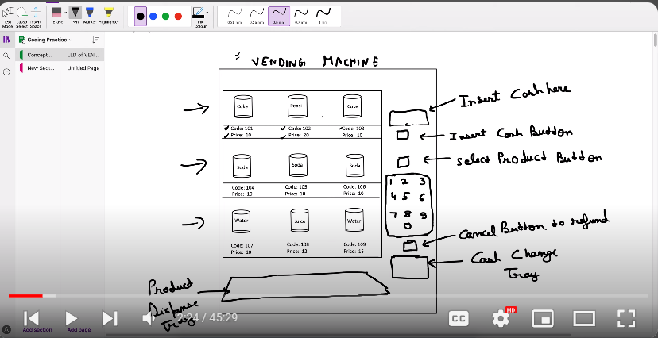

## FLOW

() -> user actions
[] -> machine state

     Machine State      ||           User Actions

1)   Ideal              ->         Press insert money
2)   Has Money          ->         Add money,select prod,Refund
3)   Product select     ->         Enter prod code ,Refund, Change
4)   Product Despense   ->         Release prod

## State Design Pattern
We can see that every state has specific operation 
this means it is State design pattern

The State design pattern is a behavioral software design pattern that allows an object to alter its behavior when its internal state changes.